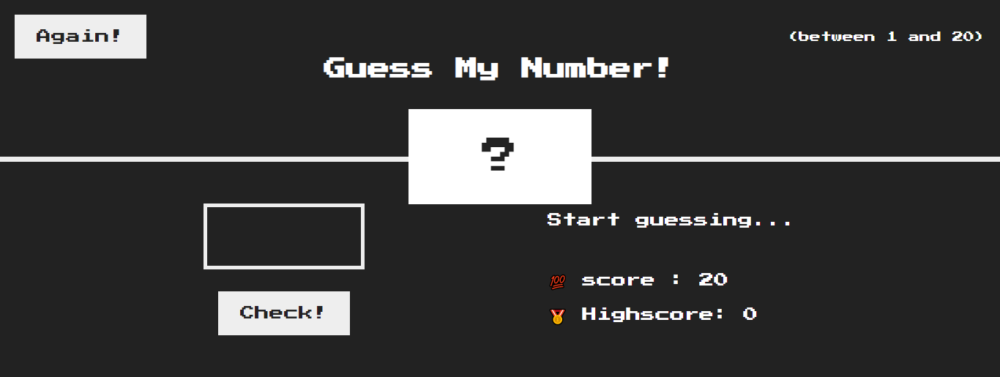
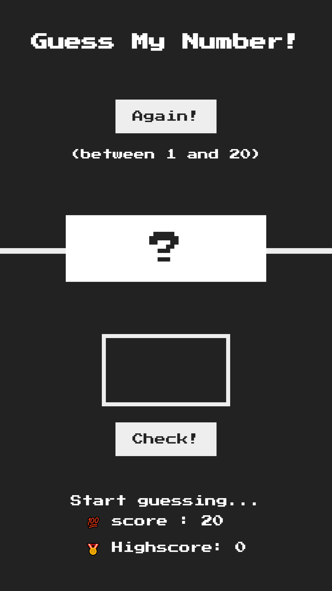

# guess-my-number


https://user-images.githubusercontent.com/93255365/188309635-86087969-1543-4e87-9dee-ad5e928da276.mp4


<<<<<<< HEAD
=======
# Guess-my-number

It's a basic game made by Dom Manipilation. There are a total of 20 numbers you can choose from.

 

- [Overview](#overview)
  - [Screenshot](#screenshot)
  - [Links](#links)
- [My process](#my-process)
  - [Built with](#built-with)
  - [What I learned](#what-i-learned)
  - [Continued development](#continued-development)
  - [Useful resources](#useful-resources)
- [Author](#author)
- [Acknowledgments](#acknowledgments)


## Screenshot

Desktop


Mobile Version




 # Built with
- Semantic HTML5 markup
- CSS custom properties
- Flexbox
- Desktop workflow


# what i learned
As a result of this project, I learned how to change the background color in javascript and how to compare scores using if/else statements

```js
 document.querySelector('body').style.background = 'green';

```
```js
 if (!guess){
   document.querySelector('.title__right-box').textContent =  '⛔ No answer' ; 
    
   }
   else if(guess === secretNumber){
    document.querySelector('.title__right-box').textContent =  '🎉 correct number' ; 
   }

```

## Useful resources

- [Modern JavaScript Tutorial by Net ninja](https://www.youtube.com/watch?v=wKBu_dEaF9E&t=1935s)
 - [JavaScript HTML DOM Wschool](https://www.youtube.com/watch?v=wKBu_dEaF9E&t=1935s)


## Author
- Live Site URL: [Add live site URL here](https://guess-my-number-tau.vercel.app/)


## Acknowledgments
Jonas's course and Mosh Hamedani's helped me understand how to learn javascript because there are many challenges for me and the challenges helped me improve some Javascript basics
>>>>>>> f230fb40b5e8d5947fa72f4c2c913fe2addec259
